# Training Performance and Trainee Behavior Analysis Platform

A full-stack web-based training management platform designed to manage training courses, monitor trainee progress, and analyze course performance and withdrawal behavior.

The system provides separate functionality for **Students, Instructors, and Administrators**, with role-based access to ensure that each user can perform the operations relevant to their responsibilities.

## Overview

Traditional training management methods may make it difficult to monitor trainee progress, evaluate course performance, and understand why trainees withdraw from courses.

This project provides a centralized platform that stores training activities as structured digital data and transforms them into useful performance indicators.

The platform allows trainees to enroll in courses, complete lessons, monitor their progress, and withdraw from courses with a documented reason. Instructors can manage lessons and monitor the progress of trainees enrolled in their courses. Administrators can manage courses, users, instructors, and review training performance statistics through the dashboard.

## Main Features

### Student

* Register and log in to the system.
* Browse available training courses.
* View course details and lessons.
* Enroll in courses.
* View enrolled courses.
* Track course progress.
* Mark lessons as completed.
* Automatically calculate completion percentage.
* Automatically mark an enrollment as completed when all lessons are completed.
* Withdraw from a course.
* Select a predefined withdrawal reason.
* Provide an optional withdrawal note.
* View completed lessons and completion dates.

### Instructor

* View assigned courses.
* View course information.
* Add lessons to assigned courses.
* Update lesson information.
* Delete lessons.
* Manage lesson order.
* Set lesson availability dates.
* View enrolled trainees.
* Monitor trainee progress.
* View enrollment status and withdrawal information.

### Administrator

* Manage users.
* Activate and deactivate user accounts.
* Assign user roles.
* Create and update courses.
* Assign instructors to courses.
* Publish and unpublish courses.
* Logically delete courses.
* Manage training course information.
* View platform statistics.
* Analyze enrollment, completion, and withdrawal data.
* Review withdrawal reasons and their frequency.

## System Roles

| Role       | Main Responsibilities                                                     |
| ---------- | ------------------------------------------------------------------------- |
| Student    | Browse courses, enroll, complete lessons, track progress, withdraw        |
| Instructor | Manage assigned courses and lessons, monitor trainee progress             |
| Admin      | Manage users and courses, assign instructors, analyze platform statistics |

## Screenshots

### Login Page

The login page allows users to access the platform using their registered credentials.

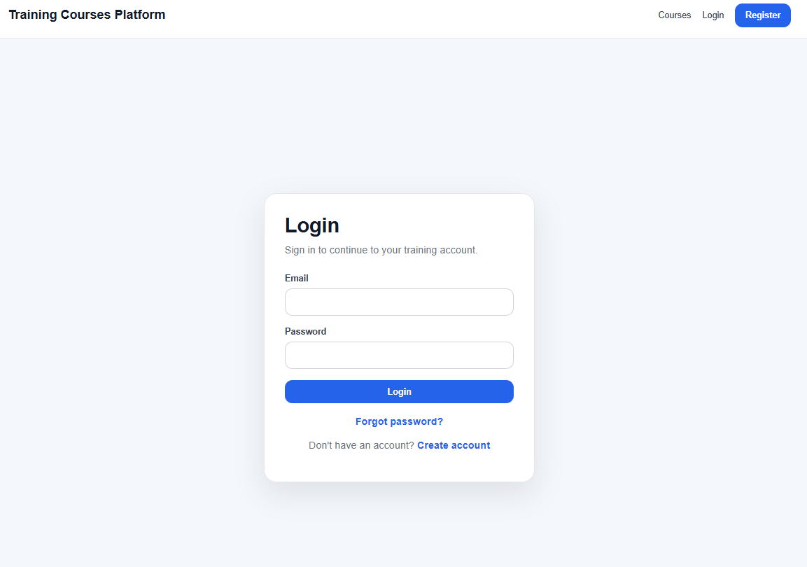

### Registration Page

The registration page allows new users to create an account and provide their basic information.

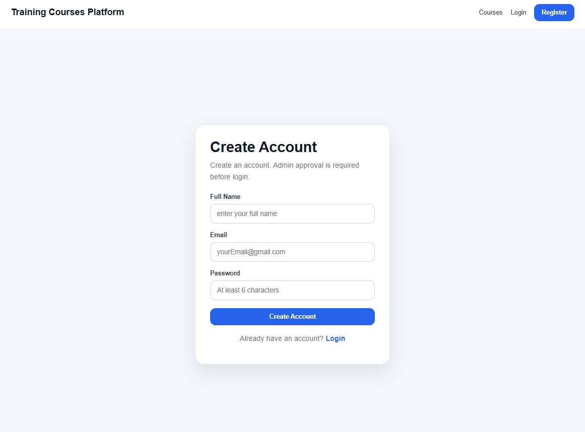

---

## Student Interface

### Available Courses

The available courses page allows students to browse and explore the training courses available on the platform.

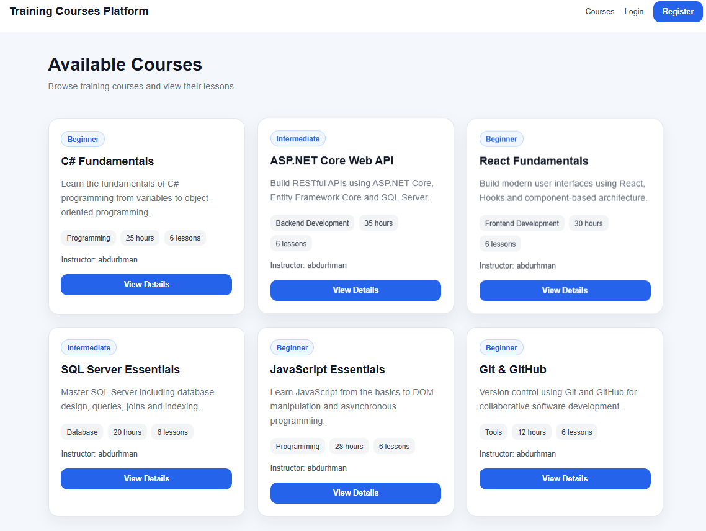

### My Courses

The My Courses page displays the courses in which the student is enrolled and allows the student to monitor their learning progress.

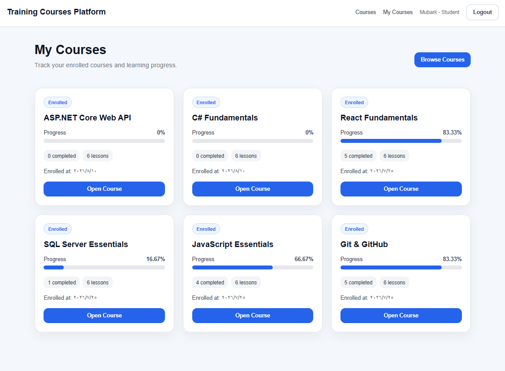

---

## Instructor Interface

### Instructor Panel

The instructor panel provides access to assigned courses and the main course management functions.

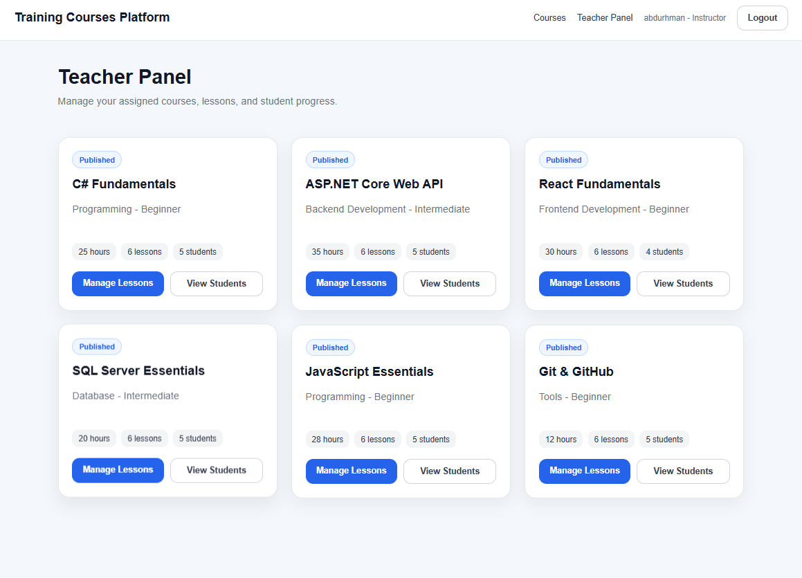

### Student Progress

The student progress page allows instructors to monitor trainee enrollment status, completed lessons, and overall course progress.

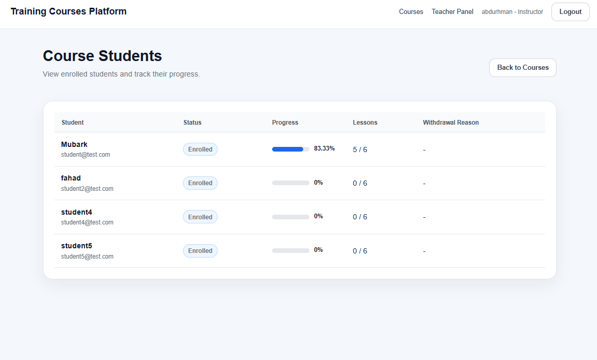

### Lesson Management

The lesson management page allows instructors to add, update, delete, and organize lessons within their assigned courses.

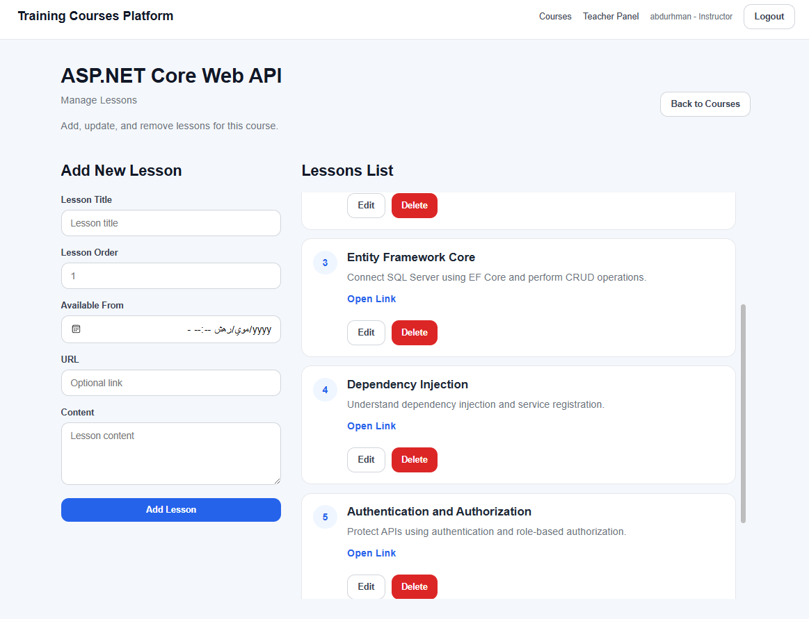

---

## Administrator Interface

### Admin Dashboard

The admin dashboard provides an overview of the platform through statistics related to courses, users, enrollments, completion, and withdrawal activity.

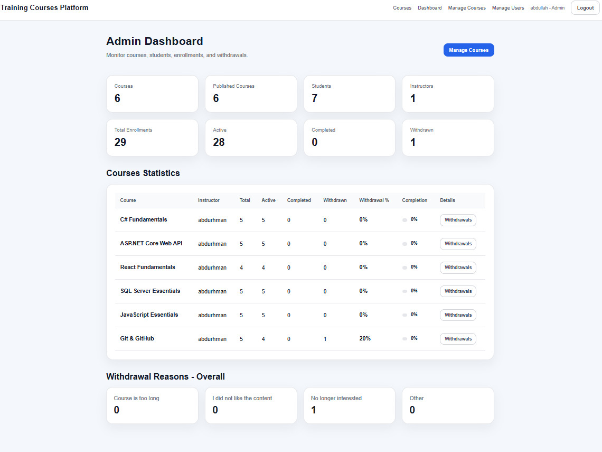

### Course Management

The course management page allows administrators to create and manage training courses, assign instructors, and control course information.

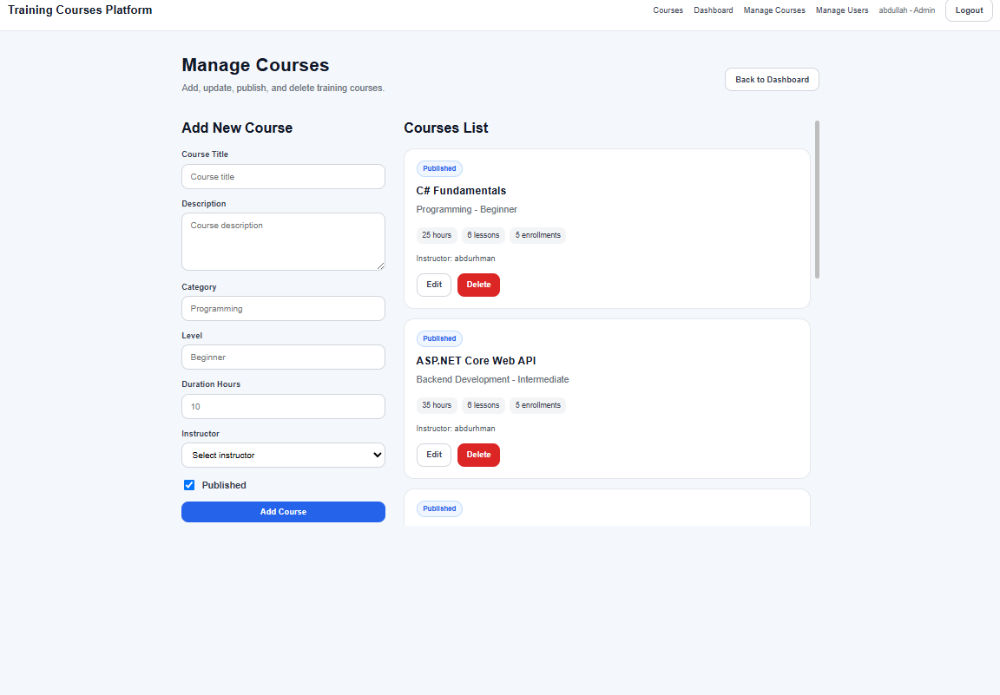

### Users Management

The users management page allows administrators to view registered users, activate or deactivate accounts, and manage user roles.

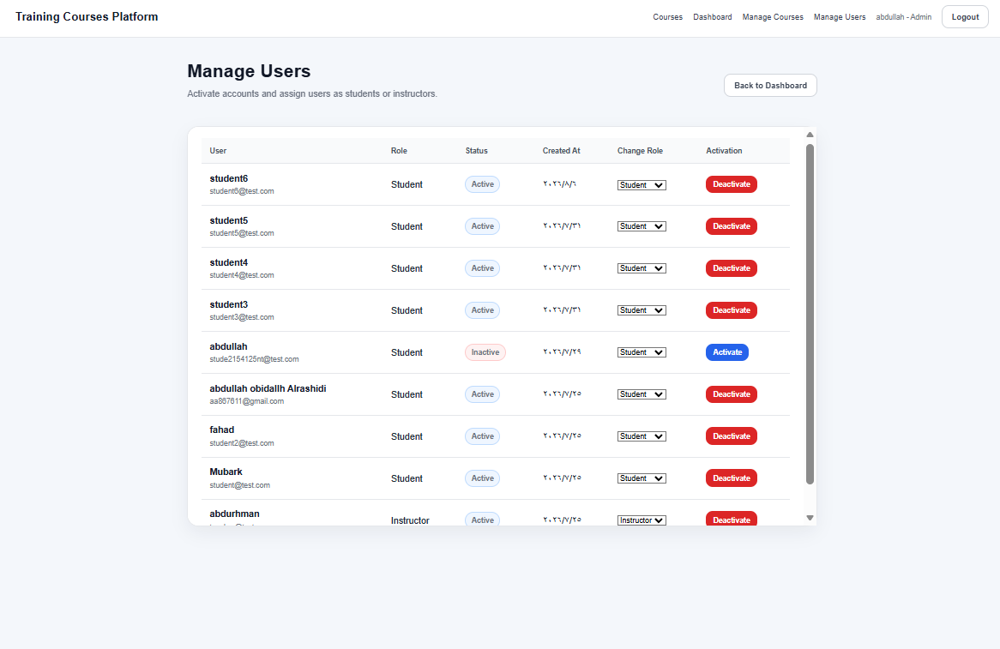

### Withdrawal Analysis

The withdrawal analysis page allows administrators to review withdrawal information and analyze the reasons selected by trainees when leaving courses.

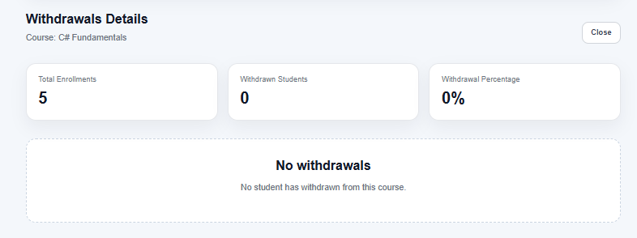

## System Architecture

The application follows a three-layer web application structure:

```text
┌─────────────────────────────┐
│       React Frontend        │
│     React + Vite + CSS      │
└──────────────┬──────────────┘
               │
               │ REST API / HTTP
               ▼
┌─────────────────────────────┐
│    ASP.NET Core Web API     │
│        Controllers          │
│        DTOs / Logic         │
└──────────────┬──────────────┘
               │
               │ Entity Framework Core
               ▼
┌─────────────────────────────┐
│        SQL Server           │
│ Users / Courses / Lessons   │
│ Enrollments / Progress      │
│ Withdrawal Reasons          │
└─────────────────────────────┘
```
The React frontend is responsible for the user interface and communication with the backend through REST API endpoints.

The ASP.NET Core backend handles requests, validates data, applies business rules, and communicates with the database through Entity Framework Core.

SQL Server stores the persistent system data and relationships between users, courses, lessons, enrollments, progress records, and withdrawal reasons.

## Database

The main database entities include:

* `Users`
* `Courses`
* `Lessons`
* `Enrollments`
* `StudentLessonProgress`
* `WithdrawalReasons`

The database uses relationships between these entities to support the complete training workflow.

For example:

```text
User
 │
 ├── Instructor ──> Courses ──> Lessons
 │
 └── Student ──> Enrollments ──> Courses
                    │
                    └── StudentLessonProgress
```

Withdrawal information is stored as part of the enrollment record and can reference a predefined withdrawal reason.

## Progress Tracking

The platform calculates trainee progress based on completed lessons.

For an enrollment:

```text
Progress Percentage =
Completed Lessons / Total Lessons × 100
```

When all available lessons in a course have been completed, the enrollment status is automatically changed to:

```text
Completed
```

This allows the platform to maintain consistent progress information without requiring administrators or instructors to manually calculate completion.

## Withdrawal Analysis

Students can withdraw from an enrolled course by selecting a predefined withdrawal reason.

The system supports predefined reasons such as:

* Course too long
* Didn't like the content
* Not interested anymore
* Other

An optional withdrawal note can also be provided when additional information is required.

The stored withdrawal data allows administrators to identify common reasons for course withdrawal and evaluate whether particular training programs require improvement.

## Dashboard and Analytics

The administrator dashboard provides an overview of training activity through measurable indicators.

Examples include:

* Total courses
* Total students
* Total instructors
* Total enrollments
* Active enrollments
* Completed enrollments
* Withdrawn enrollments
* Course completion rates
* Course withdrawal rates
* Withdrawal reason statistics

These indicators provide a structured view of training performance and support data-driven administrative decisions.

## Technologies

### Frontend

* React
* Vite
* JavaScript
* HTML
* CSS

### Backend

* C#
* ASP.NET Core Web API
* Entity Framework Core

### Database

* Microsoft SQL Server
* SQL Server Management Studio (SSMS)

### Development

* Visual Studio
* RESTful APIs

## Project Structure

The project is divided into frontend and backend components.

```text
TrainingCoursesSystem
│
├── TrainingCoursesSystem.Server
│   ├── Controllers
│   ├── DTOs
│   ├── Models
│   ├── Data
│   ├── Services
│   └── Program.cs
│
└── TrainingCoursesSystem.client
    ├── src
    │   ├── pages
    │   ├── components
    │   ├── api
    │   ├── auth
    │   └── constants
    └── package.json
```

## Development Methodology

The project was developed using the **Waterfall Model**.

The main development phases were:

1. Requirements Analysis
2. System and Database Design
3. Implementation
4. Integration
5. Testing and Debugging
6. Documentation

This approach provided a structured development process in which each major stage was completed before progressing to the next stage.

## Security and Access Control

The system separates functionality according to user roles.

Administrative operations are restricted to administrators, while instructor operations are limited to assigned training content.

The backend also validates important relationships before performing operations. For example, when an instructor modifies a lesson, the system verifies that the course belongs to that instructor.

Similarly, when a student completes a lesson, the backend verifies that:

* The enrollment exists.
* The enrollment is active.
* The lesson exists.
* The lesson belongs to the enrolled course.
* The lesson has not already been completed.

This prevents invalid operations from being performed only by manipulating frontend requests.

## Future Improvements

Potential future improvements include:

* Trainee dropout-risk prediction using machine learning.
* More detailed trainee engagement analysis.
* Login and activity tracking.
* Lesson viewing-time analysis.
* Advanced dashboard visualizations.
* Report export to PDF and Excel.
* Automated notifications for low-progress trainees.
* Course recommendation functionality.
* Arabic language support.
* More advanced authentication and authorization mechanisms.

## Academic Context

This project was developed as part of a **Cooperative Training Project** in Software Engineering.

The project demonstrates the application of software engineering concepts including requirements analysis, database design, RESTful API development, frontend development, role-based functionality, data management, system integration, and testing.

## License

This project is intended primarily for academic and educational purposes.
